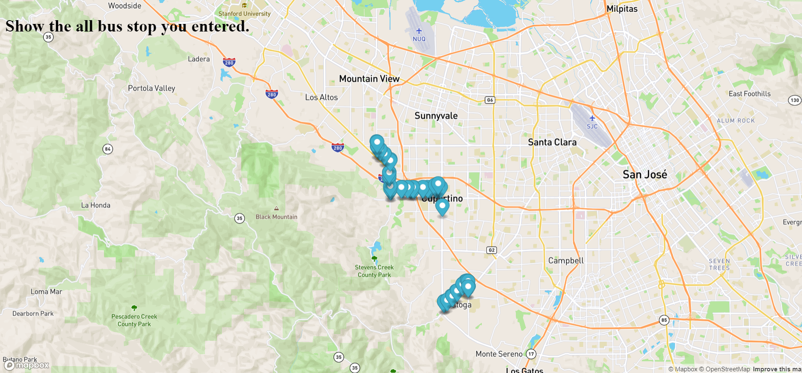

# VTABusstopSearch-Week9-

## Description:
  This is assignment from ***Professional Certificate in Coding: Full Stack Development with MERN*** Week9.
  This program consists of javascript, html, and img files.
  This program search all of the busstop you entered.

## Installation:
  1. Downloads each file into one file.  
    1. **style.css**  
    2. **VTABusSearch.html**  
    3. **mapanimation.js**  
  2. Click **index.html** and run on the Web browser.
  
## Usage:
  
If successfully installed and run on the Web browser, you will be asked the number via console, and after entering the number, the map and the VTA bus stops appear.

  
## Support:
  If any question, message me via **[my twitter](https://twitter.com/Kojiro38895598)**.
  
## Roadmap:
  The update is not expected.
  
## License information: 
 The most of the program is coded and contrubuted by MIT. If you use the part of this code in your program and show it to public, please include the name of ***MIT***.
 Also, this program include the data from **[VTA_Data](https://gis.vta.org/gis/rest/services/Transit/BusRoutes_StopsJanuary2020_ODP/MapServer/0/query?where=1%3D1&outFields=*&outSR=4326&f=json)**, so if you use the data, please include the name of ***VTA***
